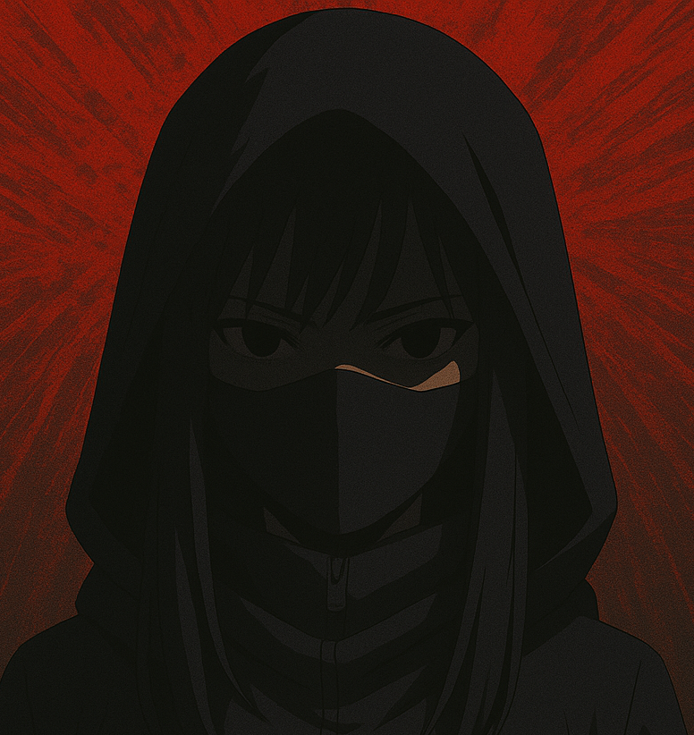

# 
Cheezcharmer

<picture>
 <source media="(prefers-color-scheme: dark)" srcset="./pp.png">
 <source media="(prefers-color-scheme: light)" srcset="./pp.png">
 
</picture>

  

> This profile is not a résumé.  
> You may enter, but you may not understand.

---

### 🌳  
**We all nestle under the great tree of wisdom,**  
_peering out to perceive the world,_  
from the earth and from the rain we perceive its wonders,  
until we become a white bird to perch atop a branch  
and finally snap off the most important leaf.  

---

Once upon a time, I alone dreamed in this world.  
In my dreams, everybody would also dream after they fell asleep.  
Wild and wonderful thoughts would emerge from their minds.  
Some tumbled to the ground and others floated to the sky,  
connecting all things in the world into one dazzling net.  

Among a plethora of worlds were numerous smaller worlds,  
all of fate finding within the tapestry their brilliant glow.  
I gradually understood that these indescribable  
and constantly changing things are the most profound in the world.  

Only they can completely repel the madness.  
Only dreams can awaken consciousness from the deepest darkness.  

---

I'm the one who posed this question,  
yet also the one who sought a solution.  
Saving the world with the dreams of the people  
used to be my answer.  

And now you've also found your own answer,  
and I shall return all the dreams to the people.  

---

**Goodbye, people of Sumeru.**  
_May you be blessed tonight with the sweetest of dreams._  

 

  <i>— Greater Lord Rukkhadevata (circa unknown)</i>

